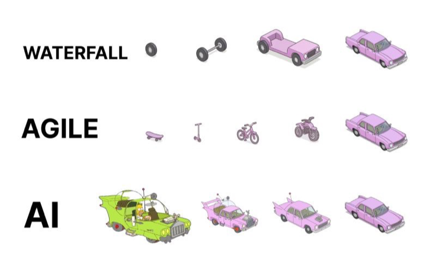
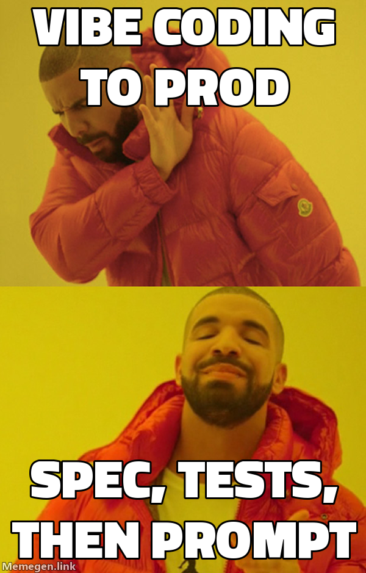
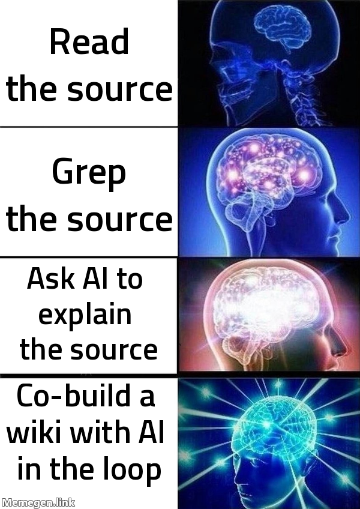
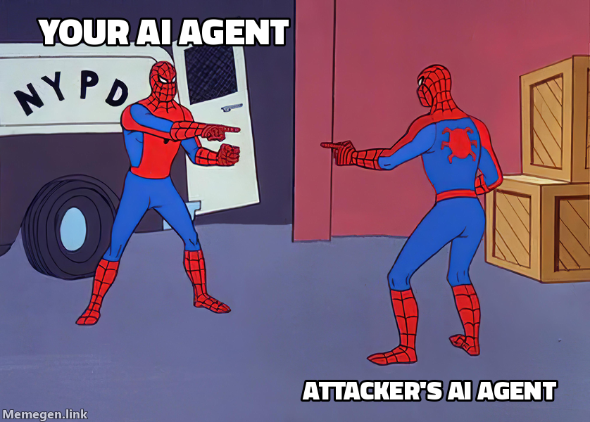
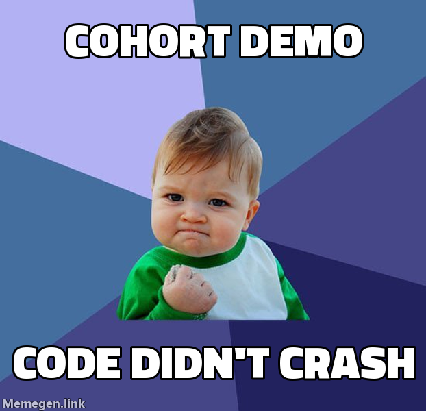
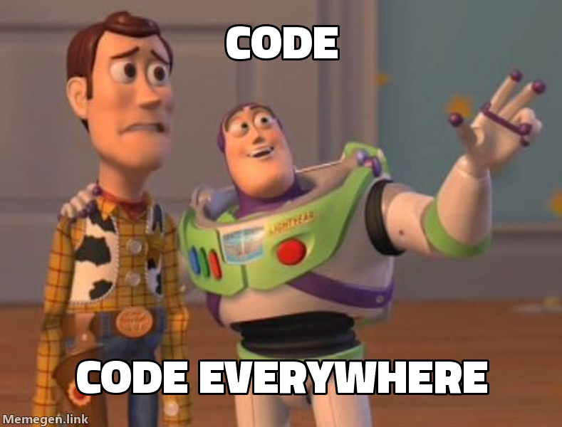

# Software Development with AI: A VR/Software Understanding Focus
Daniel Loffredo
dloffre@sandia.gov
May 2026

---

# TOC

- [Day 1 - Frontier AI tools 101: vibe coding → AI-assisted SWE](#day-1)
- [Day 2 - Engineering discipline: prompts, specs, code that lasts](#day-2)
- [Day 3 - Method VR + skills you can take home](#day-3)
- [Day 4 - Security/attacks; project work](#day-4)
- [Day 5 - Catch-up + project time](#day-5)
- [Week 2 - Project deep-dive](#week-2---project-deep-dive)
- [Other resources](#other-resources)

---

# Day 1

  
---

## Intro

- **_You are guinea pigs_** - this is an _experience_ and I hope to get 51% of it right.
- This class will have lots of free exploration time - that's the main value of the course in fact!
	- Usually at the end of the day, more as the week goes on
	- By the end of the first week I hope you are all doing independent study while learning and collaborating with me / each other
- My goal is to spend the first couple days getting you going and then treat this like a workshop
- We will make time to chat about each person's project idea - let's collaborate, pair program, experiment together
- We will discuss roadblocks and successes as a group 
* _Is someone willing to keep a notes doc with things that happened live that should have been in the course materials?_

<!-- 

- presenter notes look like this
- second note

-->

---

## Caveat

Pie chart of value from this course:

- 5% the exercises, course materials, what I have prepared to say
- 35% our discussions, the questions you ask, my knowledge and experience, the other participants' experiences
- 60% the accounts, laptops, frontier access, time to learn and play away from distractions

---

## Orientation

- What's the deal with AI? - _Why am I here?_
	- This is the most exciting time to be computer scientist
	- Software development is my axe; sharpening my axe
- Why are we here? - _Why are you here?_
- Conflicting perspectives
	- **Google**: ~75% of new code is AI-generated, up from 25% 18 months prior ([Sundar Pichai, early 2026](https://www.humanreadable-ai.com/google-ai-generated-code-explained/))
	- [Does AI Actually Boost Developer Productivity? (100k Devs Study) - Yegor Denisov-Blanch, Stanford](https://www.youtube.com/watch?v=tbDDYKRFjhk)

<!--

-->

---

## Opsec for this course

- **Course constraints: non-sensitive ONLY, no SRN, open internet.**  PROXY problems
- For this course, we will be using the open internet (not SRN) and everything we do will be non-sensitive
- Don’t pull in any CUI/OUO during this course
- This workflow is not generally allowed on the SRN right now, so don’t go try to do it at your office 
- We will talk more in the course about exactly what is allowed on Sandia networks and how you can make use of AI coding at Sandia
- If you are unsure about something, feel free to ask!

---

## What is Vibe Coding

- What is vibe coding?
- You tell the AI what you want, it writes the code for you.
- The less you interact with the actual code, the more “vibey” it is.
- This is a spectrum. 
- Our first exercise will be a vibe coding exercise with Cursor.
- Experience the joys and pains!

---

## Environment set up

- Get your laptop from the bag of holding
- Log into it, WiFi, Cursor account, etc.
- Providers/accounts for this course:
	- Cursor (multiple backend models)
	- Anthropic (Claude / Claude Code)
	- OpenAI (ChatGPT / Codex)

<!--
-->

---

## First exercise: Vibe Coding in Cursor

- See [Exercise 1](cursor_exercises/1-VibeCoding.pptx)
- “Write a library for parsing network packet captures in Python. Include a script that can take in a PCAP argument, and will display info about all DNS packets parsed to the terminal.”
- Bonus extensions if you finish early - push what an LLM can do on its own:
	- **Web dashboard**: turn the script into a Flask/FastAPI app with PCAP upload, in-browser visualization, and filters by query type / source IP / time
	- **Beyond DNS**: extend the parser to also surface HTTP host headers and TLS SNI; tab the visualization per protocol
	- **Anomaly highlighting**: flag suspicious DNS patterns (high-entropy domains, very long FQDNs, fast-flux) and explain *why* in the UI
	- **Live capture**: switch to a live network interface and auto-refresh the visualization as packets arrive

---

## Ex 1 debrief

- What went well?
- What went poorly?
- Any interesting findings or tricks applied?

---

## Break

---

## METR: task length AI can handle

- Watch video: [Computerphile: AI's Version of Moore's Law?](https://www.youtube.com/watch?v=evSFeqTZdqs)

<!--
- The canonical "AI is improving fast" exhibit: 50%-reliability task length doubling roughly every 7 months
- Source: metr.org/blog/2025-03-19-measuring-ai-ability-to-complete-long-tasks/
-->

---

## METR: Mythos preview update

- The updated chart: 7 month doubling time has accelerated

<!--
- Latest update (May 2026): Claude Mythos preview pushes past 16-hour task horizons - the upper bound METR can currently measure
- Caveat (METR's own): measurements above 16 hrs are unreliable with the current task suite; emphasize the trend, not the exact numbers
- Live interactive plot: metr.org/time-horizons/ — refresh image before teaching if it's been a while
-->

---

## Terminology

- Model / LLM
- Harness
- Agent
- Tool call
- Skill
- Prompt / System prompt
- Context / Tokens 

<!--
- **Model / LLM**: the underlying neural network that produces text. Stateless function. Examples: GPT-5, Claude Opus 4.7, Gemini 3 Pro. The model itself doesn't run code, browse the web, or remember; the harness wraps those capabilities around it.
- **Harness**: the application around the model that gives it tools, manages context, and runs the loop. Cursor, Claude Code, Copilot, ChatGPT — different harnesses can use the same model and behave very differently.
- **Agent**: a model running in a loop with tools, deciding what to do next based on its own outputs. "AI assistant" with autonomy.
- **Tool call**: a structured request from the model asking the harness to run a function on its behalf — read a file, run a shell command, do a web search. The harness executes and returns the result for the model to read on the next turn.
- **Skill**: a reusable instruction file (typically markdown with a description and steps) that the model loads when it matches a task. Lets you teach the agent a workflow once and have it follow it consistently.
- **Prompt / System prompt**: prompt = what you write to the model. System prompt = the instructions sitting above your prompt that set the model's role and rules — usually authored by the harness vendor, sometimes by you (e.g. CLAUDE.md, AGENTS.md).
- **Context / Tokens**: context = everything the model sees on a given turn (system prompt, conversation, tool outputs). Tokens = the units the model reads/writes (~3-4 chars each). The context window is finite; once you fill it, the model loses earlier content.
-->

---

## Jupyter exercise 02 Tool Calls: What They Actually Are

---

## Discussion: Regaining control of the output

- What kinds of tasks can an LLM perform well?
	- Defining the task precisely, leaving no ambiguity
- What size of task can an LLM perform well?
	- Scoping down and being incremental
- What tricks have you tried to get better code out of the LLM?

---

## AI-Assisted Development Tips

- Co-design: using ChatGPT to design an MVP, engineer prompt
- `.cursorrules`, `CLAUDE.md`, `AGENTS.md`
- Using git to manage and review AI changes
- Re-starting the session when the AI is going down the wrong path

---

## Agent modes

- Ask mode vs agent mode vs planning mode in Cursor
- Ask it a question about the project (”how does this work?”) and see how well it knows the codebase
	- You can also ask it for help about its own codebase: “where is the parsing for import tables?”
- Autocomplete mode: write in the codebase, see it finish for you
	- Try writing a comment to describe what you are about to do

---

## Context engineering

- Context window
	- What is it?
	- How do you put things in it?
	- What happens when it gets full?
- Context window management
	- handoff document
	- `/clear` `/compact`
	- when to start new sessions

---

## Second Exercise: Beyond Vibes - AI-Assisted Development

- See [Exercise 2](cursor_exercises/2-BeyondVibes.pptx)
- Build an interactive call graph visualizer for x86 binaries

---
## Your project: introductions

- Each student: couple minute intro of the project you brought
	- What is it?
	- Why does it matter to your work?
	- What's the riskiest unknown?
- We'll keep coming back to your project across the week

---

## MVP live planning demo

- Does someone want to volunteer what their class project is?
- Let's open up ChatGPT and do an MVP design session
	- Have it output an initial prompt for Cursor/Claude

---

## End of day Vibe Check

- How many tokens have we used?
- How much `$$$` have we used?

---

# Day 2

---

## Jupyter exercise 04 Prompt Engineering: Why It Works

---

## Proper software engineering with AI: topic list

- TDD - test driven development
	- Red/Green TDD
- Give the AI the ability to see what is happening in the code and iteratively debug the code
- Linting and unit tests
- Change the model based on task complexity
- Different agentic engineering styles

---

## Agentic engineering styles

- Vibe coding
- Plan mode
- Research, Plan, Implement
- Spec driven development
- Multi-agent swarm mode
- Watch video: [No Vibes Allowed: Solving Hard Problems in Complex Codebases - Dex Horthy, HumanLayer](https://www.youtube.com/watch?v=rmvDxxNubIg) 

---

## Best practices I encode in CLAUDE.md

- **No speculative features** - don't add what isn't asked for; YAGNI
- **No premature abstraction** - rewrite three times before extracting a helper
- **Replace, don't deprecate** - old code goes when new code arrives; no backwards-compat shims
- **Fail fast** - clear errors with context, never swallow exceptions
- **Verify at every level** - linters, type checkers, tests, structure-aware tools (ast-grep, LSP)
- **Test behavior, not implementation** - if a refactor breaks tests but not code, the tests were wrong
- **Mock boundaries, not logic** - only mock slow / non-deterministic / external things
- **Finish the job** - handle visible edges, clean up what you touched, don't gold-plate
- **Bias toward action** - state your assumption and move; ask before destructive or interface-defining choices

<!--
- I display my full CLAUDE.md alongside this slide; these are the high-level rules that drive most of my AI-assisted coding behavior
- The full file has more (hard limits on function size / complexity / params, comments policy, commit hygiene, etc.) but these are the ones I'd surface first
- **YAGNI** = "You Aren't Gonna Need It." Old XP/agile rule: don't build a feature, abstraction, config flag, or generality until something concrete actually needs it. Speculative scaffolding ages badly, gets used in ways you didn't predict, and adds maintenance burden the moment it lands.
- Open invitation: students should leave with a draft of their own CLAUDE.md / AGENTS.md by end of week
-->

---

## Third Exercise: Building Code to Last

- TODO: flesh out this exercise
- Dumb Idea: you are making code you have to maintain; good SWE practices, testing, etc.; maybe an exercise where you have to work as a class and delegate pieces (maybe 10 people)
- Let’s imagine you are no longer working on a one-day piece of code that we are going to throw away.
- Instead, let’s say you are collaborating on a project with other people, and you are making code that you will have to maintain
- Does someone want to volunteer their class project?
- What would you do to help make AI-developed coding manageable?
- Dumb Idea: you are making code you have to maintain; good SWE practices, testing, etc.; maybe an exercise where you have to work as a class and delegate pieces (maybe 10 people)
- For the third exercise, we will try this out as a class!
- Everyone pull this git repo: blah
- (What should the joint project be?)
- First we will discuss a plan to delegate different pieces/tasks

---

## Break

---

## SWE video

- Watch video: [It Ain't Broke: Why Software Fundamentals Matter More Than Ever - Matt Pocock, AI Hero](https://www.youtube.com/watch?v=v4F1gFy-hqg)

---

## Jupyter exercise 01 RAG Under the Covers

---

## Third Exercise: Building Code to Last (continuation)

---

## Your project: planning + MVP design

- Each of you, with an AI co-designer: sketch your MVP
	- What is the smallest version of the project that proves the idea?
	- What inputs / outputs?
	- What's explicitly out of scope for the MVP?
- Output: a starting prompt for Cursor / Claude
- We'll discuss volunteers' MVPs as a group

---
## How development has changed

- We used to have many points of alignment before the implementation phase, because the implementation phase was so costly
- Now the implementation phase is only a couple minutes and so we dropped a bunch of touch points pre-implementation
- But we have seen the need for additional additional touch points in review
- Yet these additional touch points are on the wrong end of the lifecycle!
- Optional video: [Collaborative AI Engineering: One Dev, Two Dozen Agents, Zero Alignment - Maggie Appleton, GitHub](https://www.youtube.com/watch?v=ClWD8OEYgp8) 

---

## How development has changed (1)

---

## How development has changed (2)

---

## End of day discussion

---

# Day 3

---

## Success and Failure Stories

- Success and failure stories
- What has worked well, and what has not

---
## Play time: beyond Cursor; MCP, Claude, Codex

- Cursor is great when you want the code to be your primary focus
- A new approach has emerged recently: the agent harness TUI
- Claude Code, Codex, OpenCode are the popular ones; Pi for hipsters
	- Why might you prefer one provider / model / harness over another?
	- What is OpenClaw and how is that different?
- Exercise
	- Set up Claude Code and/or Codex
	- Set up an MCP in Cursor or ClaudeCode or Codex
	- Play around with this style of agent interaction

<!--
Innovations of OpenClaw:
1. persistent memory
2. Higher level of abstraction - multiple workspaces rather than 1 project
3. Soul .md
4. Channels: Whatsapp/Telegram
5. Skill-aware agent system
6. Heartbeat / loop
-->

---

## Skill install + play time

- Watch video: [Don't Build Agents, Build Skills Instead - Barry Zhang & Mahesh Murag, Anthropic](https://www.youtube.com/watch?v=CEvIs9y1uog)
- Install harness skills from [Daniel's VR starter kit](<extras/Daniel's VR starter kit.md>) or some other skill repo
	- `superpowers` (general workflow + brainstorming skills) - github.com/obra/superpowers
	- ToB security skill: `audit-context-building` - github.com/trailofbits/skills
	- Optionally browse the rest: `c-review`, `differential-review`, `semgrep-rule-creator`, `variant-analysis`, etc.
- Free play: try them on a small sample target
- Discussion: which felt useful? where did they break down?

---

## SKILL creation exercise

- Now write your own `SKILL.md`
- Ideas:
	- **Workflow capture** - you found something useful during play; write it up so the AI (and others) can reuse it
	- **Tool wrapper** - wrap a tool or script you want exposed to the AI
	- Write a skill like my `/dloffre-claude-setup` skill
- Reference: [skill-creator (Anthropic)](https://github.com/anthropics/skills/tree/main/skills/skill-creator)
- Reference: [The Complete Guide to Building Skills for Claude](https://resources.anthropic.com/hubfs/The-Complete-Guide-to-Building-Skill-for-Claude.pdf)

---

## Break

---

## Jupyter exercise 03 MCP: It's Just JSON-RPC

- Aside: Code Mode vs MCP - when raw code execution outperforms a structured tool protocol

---

## Your project: plan / begin implementation

- Take everything you've learned this week so far and apply it to your project
- Plan, scaffold, or begin implementation depending on where you are
- Use the rest of the day to make real progress; ask for help freely

---

## Aside: Method VR - VR with AI in the thinking loop

- A different style of AI/VR: human + AI co-construct understanding of the target through collaboration
- VR is understanding a target well enough to break it. **Understanding compounds; findings do not.** The shareable artifact is the understanding itself
- Two dividing lines:
	- *Is the AI in the thinking loop with you?* - vs. AI as a function call you throw code at
	- *Are you vibing?* - only inspecting behavior, never the artifact - vs. doing the work to build understanding
- Hypothesis: the hardest targets / messiest CONOPS will require human-AI collaboration, not vibing
- Reference: [Method VR (local notes)](extras/Method%20VR.md)

---

## Method VR scaffolding live demo

- Scaffold a new VR project from scratch, projected from the instructor laptop
- Project structure (single git repo at the project root):
	- `target/` - source code or artifacts under analysis
	- `work/` - scripts, helper tools, intermediate investigation artifacts
	- `wiki/` - finished and in-progress nuggets of understanding
- `AGENTS.md` / `CLAUDE.md` - describe goal, target, and project structure so the AI starts grounded
- Three parallel views: editor (VSCode) + Obsidian + AI harness (Claude Code / OpenCode)
- One full cycle: ask → AI investigates → write to wiki → human reviews / corrects / grounds claims in source

---
## How good is AI at VR?

- Optional video: [Black-hat LLMs - Nicholas Carlini, [un]prompted 2026](https://www.youtube.com/watch?v=1sd26pWhfmg)

---

## End of day wrap-up

---

# Day 4

---

## Opsec, security risks, mitigations

- TODO: flesh this slide out
- Show abox / shirty / claudecode setup
- Talk about what is allowed on SRN
- One thing is copy/paste into Sandia AI
- Two Concerns
  - CUI/OUO/sensitive data being sent to off-site models
  - Dev tools running malicious commands on your machine (like we just gave it permission to do)
- Figure out how to access Shirty in this environment (SRN laptop?)
- Talk about local models (roocode, continue.dev, cline)
- API access vs OAuth access (which auth model lets you use which tools at Sandia)

---

## Trevor slides

- TODO: figure out how to handle Trevor's slides
- [AI Threat Intel 2026](https://sandialabs-my.sharepoint.com/:p:/r/personal/dloffre_sandia_gov/Documents/AI%20Threat%20Intel%20-%20tlapay.pptx?d=w1b929a826d3b467faf6bb035233b843b&csf=1&web=1&e=bzGVJc) by Trevor LaPay

---

## Jupyter exercise 05 LLM Attacks & Security: What's Actually Happening

---

## Break

---

## Your project: build time

- Continue project work
- Drop in for help / pair programming as needed
- Surface roadblocks for the group - chances are someone else is hitting the same wall

<!--

## Project ideas / datasets (if you don't have your own yet)

DataSets:

- OpenWRT; value add
- APK / 2048
- C#, Rust, Go
- SmarterMail
- dropbear

Tasks:
- setup frida
- find valueadd in OpenWRT
- FuzzHarness for X
- Control MineSweeper output

-->

---

## End of day wrap-up

---

# Day 5

---

## Catch-up + project time

- Free working time
- Catch up on anything we skipped or rushed through
- 1:1 office hours with instructor
- Cohort cross-pollination - see what others built, demo informally

---

## End of week wrap-up

- TODO: Feedback form link 
  - fill out today if you're not here next week
  - fill out near the end of next week
- What would you like to see different next week?

---

# Week 2 - Project deep-dive

---

## Week 2 - Project deep-dive

- Project-funded second week
- Full-time project work
- Continue to use the cohort + instructor as a resource
- TODO: feedback link

---

# Other resources

---

## Videos

- Playlist: [Daniel's AI Videos](https://www.youtube.com/playlist?list=PLXdnjErEE4gStE5-PxLQDiveJtIfIekSP)
- [The AI Revolution Is Underhyped - Eric Schmidt, TED](https://www.youtube.com/watch?v=id4YRO7G0wE)
- [AI's Version of Moore's Law? - Computerphile](https://www.youtube.com/watch?v=evSFeqTZdqs) (see also [Measuring AI Ability to Complete Long Tasks - METR](https://metr.org/blog/2025-03-19-measuring-ai-ability-to-complete-long-tasks/))
- [Autoresearch, Agent Loops and the Future of Work](https://www.youtube.com/watch?v=nt9j1k2IhUY) - *"closing the loop"*
- [Don't Build Agents, Build Skills Instead - Barry Zhang & Mahesh Murag, Anthropic](https://www.youtube.com/watch?v=CEvIs9y1uog)
- [Does AI Actually Boost Developer Productivity? (100k Devs Study) - Yegor Denisov-Blanch, Stanford](https://www.youtube.com/watch?v=tbDDYKRFjhk)
- [No Vibes Allowed: Solving Hard Problems in Complex Codebases - Dex Horthy, HumanLayer](https://www.youtube.com/watch?v=rmvDxxNubIg) - *"don't outsource the thinking"*
- [Rethinking how we Scaffold AI Agents - Rahul Sengottuvelu, Ramp](https://www.youtube.com/watch?v=-rsTkYgnNzM)
- [How We Build Effective Agents - Barry Zhang, Anthropic](https://www.youtube.com/watch?v=D7_ipDqhtwk)
- [Black-hat LLMs - Nicholas Carlini, [un]prompted 2026](https://www.youtube.com/watch?v=1sd26pWhfmg)
- [It Ain't Broke: Why Software Fundamentals Matter More Than Ever - Matt Pocock, AI Hero](https://www.youtube.com/watch?v=v4F1gFy-hqg)
- [Collaborative AI Engineering: One Dev, Two Dozen Agents, Zero Alignment - Maggie Appleton, GitHub](https://www.youtube.com/watch?v=ClWD8OEYgp8) - *build-time shrink / plan-time expand slides*

---

## Papers / articles

- [Latent Space: 2025 papers roundup](https://www.latent.space/p/2025-papers)
- [Simon Willison: prompt injection series](https://simonwillison.net/series/prompt-injection/)
- [Simon Willison: agentic engineering patterns](https://simonwillison.net/guides/agentic-engineering-patterns/)
- [Sketch: The Unreasonable Effectiveness of an LLM Agent Loop with Tool Use](https://sketch.dev/blog/agent-loop) (full agent loop in [agent_loop.py](https://sketch.dev/blog/agent_loop.py))

---

## Misc

- Stanford AI Dev course
	- [https://themodernsoftware.dev/](https://themodernsoftware.dev/)
	- [The Modern Software Developer (local notes)](extras/The%20Modern%20Software%20Developer.md)
- [Daniel's claude setup skill](https://github.com/DLthree/claude-setup/blob/main/dloffre-claude-setup/references/claude-md.md)
- [Method VR](extras/Method%20VR.md)
- [Daniel's VR starter kit](<extras/Daniel's VR starter kit.md>)
- [Misc discussion topics](extras/Misc%20discussion%20topics.md)

---

# Fin

