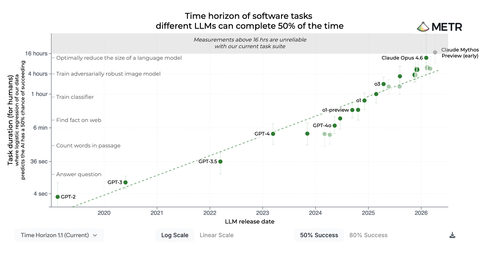
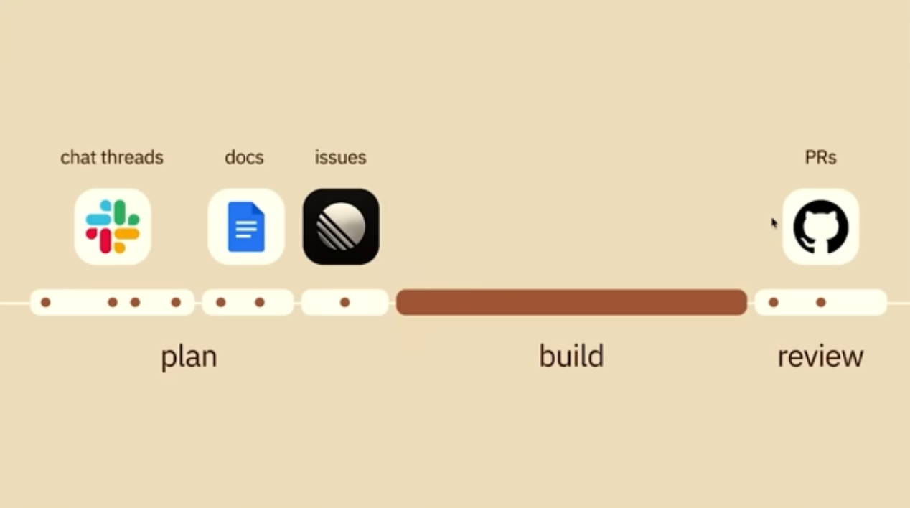
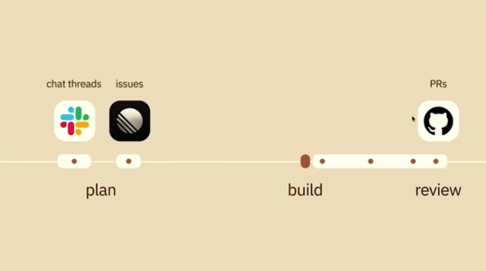

# 6 Agentic Engineering Lessons

Daniel Loffredo
dloffre@sandia.gov

---

# Intro

- **Agentic Engineering:** building software *with* AI agents as collaborators, not as autocomplete
- **METR**: 50%-reliability task length is doubling roughly every 7 months, and the doubling is *accelerating*
  - Mythos preview pushed past 16-hour task horizons in May 2026
  - Real capability gap between frontier and open-weight on long-horizon agentic work
- Frontier tools can write code as well as most humans

---

# The 6 lessons

1. Use AI to get the idea out of your head
2. Your job is mental alignment
3. Time spent planning pays back
4. Manage context like a resource
5. Skills + CLAUDE.md = your custom stack
6. Leverage both kinds of computation, in your product

---

# 1. Use AI to get the idea out of your head

- AI is great at turning a *clear spec* into code
- AI is bad at *guessing* what you actually want
- Your job: articulate the idea well enough that the AI can run with it
- Use agents to *think*, not just to type. Interrogate your own idea before any code gets written
- The bottleneck moved upstream. Writing the code isn't even the hard part anymore
- Practical move: an MVP design session *before* you write code

---

# 2. Your job is mental alignment

- **Mental alignment**: getting humans, AI, and the artifact on the same page about what's being built
- Implementation used to be costly, so we built many alignment points around it
- Implementation got cheap, we dropped those touchpoints, and the alignment problem reappeared as painful review at the *wrong end* of the lifecycle
- Use an LLM-driven wiki or markdown docs as the alignment substrate: durable, reviewable, both humans and AI read and write it
- **CLAUDE.md** is part of this surface: the always-on context that anchors the agent to your standards

---

# Lifecycle shift: build shrinks, plan expands

 

---

# 3. Time spent planning pays back

- Front-loading planning *pays back more than it costs*
- **Vibe coding is fine, *with* a plan.** Vibing is a legitimate execution mode; the trick is you nailed down the spec *before* you started vibing
- `superpowers` is really good at brainstorming, planning, spec'ing, and aligning
- Many named styles here (Research/Plan/Implement, spec-driven, plan-mode, multi-agent). Pick one. The meta-point is just *plan first*
- You have to actually review the plan
- Errors in the plan compound to the spec; errors in the spec compound to the implementation

---

# 4. Manage context like a resource

- The context window is the working memory
- Target using only the first 40-60% of your context window
- Each independent task should be in its own session
- Use CLAUDE.md and other docs to supplement this working memory
- Tactical tools: `/clear`, `/compact`, handoff documents, knowing when to start a new session
- Proper task scoping = a task that fits in **one good context window**
- Handoffs aren't just session-to-session. They're you-to-future-you, and you-to-teammate

---

# 5. Skills + CLAUDE.md = your custom stack

- A **skill** is a reusable instruction file the model loads when it matches a task. Teach the workflow once, get consistent execution thereafter
- Start with **superpowers** (obra/superpowers): general workflow, brainstorming, debugging skills out of the box
- Build your **own** skill stack: the workflows *you* run repeatedly, written down so the AI runs them the way you would
- Skills compose and build on top of each other
- The artifacts you accumulate (skills, CLAUDE.md, wiki) travel across projects and get better with use

---

# 6. Leverage both kinds of computation, in your product

- There are now 2 forms of computation available, with very different pros and cons
  - **Statistical / probabilistic** (LLMs): flexible, intelligent, adaptable, but costly and slow
  - **Classical / deterministic** (code): cheap, reproducible, testable, fast, but rigid
- Your job: decide *carefully* which parts of your solution use which, and where the handoffs happen
- This is the architectural skill of the new era. Not "use AI for everything" or "use AI for nothing"

---

# Questions?
